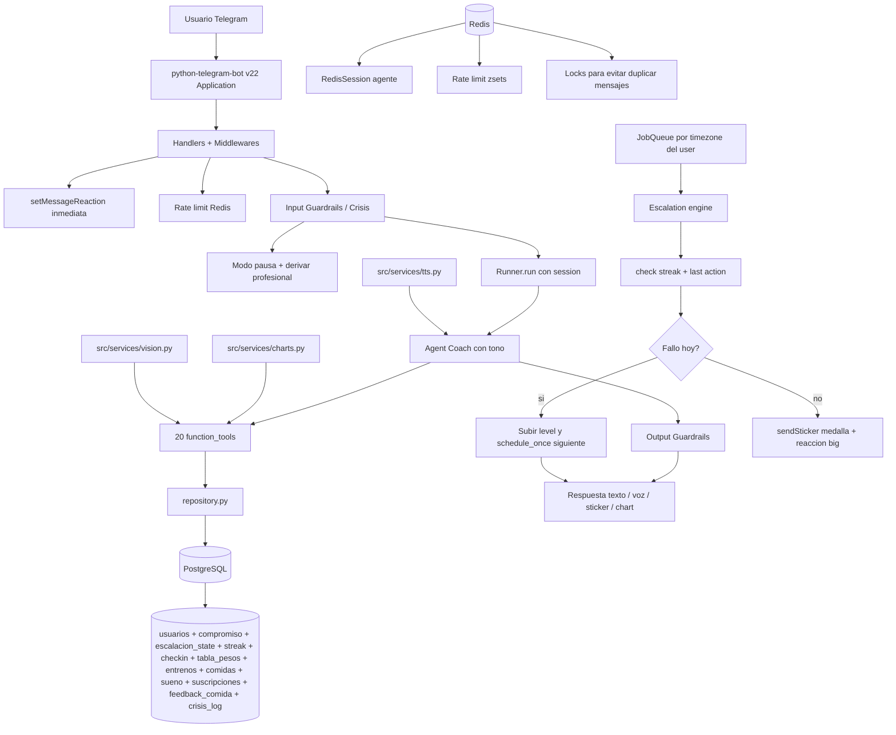
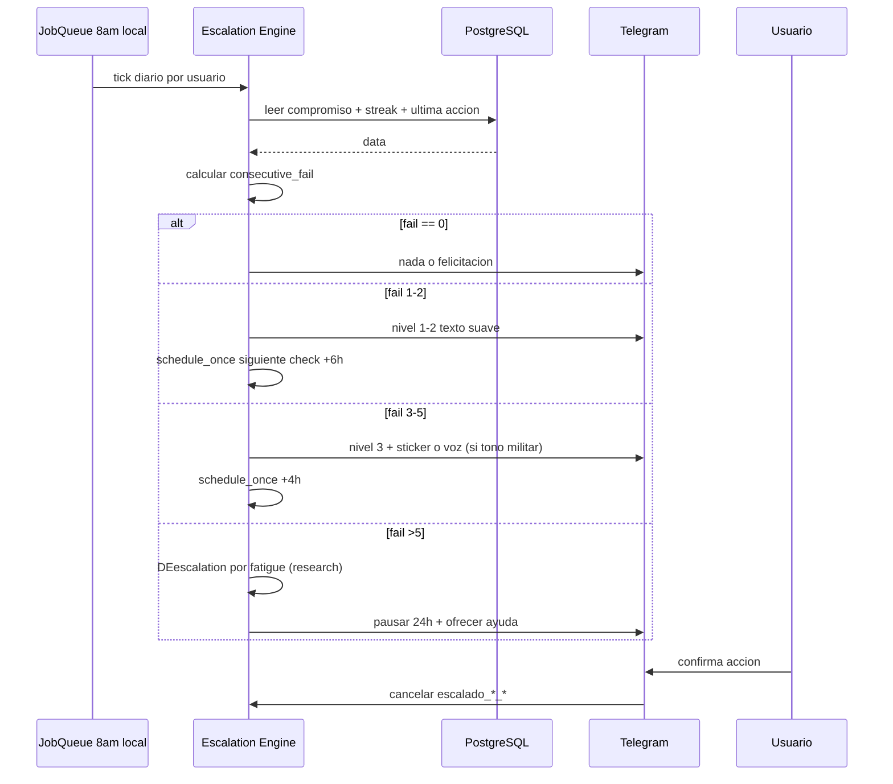

# Plan Maestro EntrenadorAX

## Diferenciador unico

> **"El coach que NO te deja en paz cuando fallas tu propio compromiso, te cura semanticamente con palabras que duelen pero motivan, y escala la frecuencia hasta que cumples o pides pausa explicita."**

## Inputs del plan

- **Research externo** (ya en repo): [research/competitor-analysis.md](research/competitor-analysis.md) (48 productos, 150+ fuentes) y [research/tough-love-coaching-framework.md](research/tough-love-coaching-framework.md) (marco etico-cientifico).
- **Skills propios**: 5 en `.cursor/skills/` (ciencia-entrenamiento-mundial, openai-agents-sdk, python-telegram-bot-v22, fastapi-sqlalchemy-async, pydantic-settings-redis).
- **Subagents**: `entrenador-experto-cscs` (validar contenido deportivo), `experto-stack-entrenadorax` (auditar codigo).
- **Rules**: `entrenador-ax-conventions.mdc` y `openai-agents-sdk-patterns.mdc` se aplican automaticamente.
- **Hooks**: `validar-function-tool.sh` ya bloquea tools sin docstring, `proteger-secretos.sh` ya bloquea commits con tokens, `ruff-autofix.sh` formatea Python.

## Decisiones congeladas

- Tono: **3 modos configurables** (amigable / firme / militar) — el user elige en onboarding y puede cambiar via `/tono`.
- Monetizacion: **Free en V1, Telegram Stars en V2** cuando haya >100 usuarios activos.
- Plataforma: **Telegram unico** (no app, no web admin de usuario por ahora; admin interno via FastAPI + JWT en V2).
- Idioma V1: **espanol** (multi-idioma en V3).

## Estado actual: gaps criticos

Auditando [src/coach.py](src/coach.py), [src/tools.py](src/tools.py), [src/telegram/handlers.py](src/telegram/handlers.py), [src/telegram/scheduler.py](src/telegram/scheduler.py), [src/db/models.py](src/db/models.py):

```mermaid
flowchart LR
    subgraph hoy [EntrenadorAX HOY]
        A1["sendMessage texto plano"]
        A2["6 jobs diarios sin escalation"]
        A3["12 tools sin tono configurable"]
        A4["JobQueue UTC global"]
        A5["Sin TTS, sin photo, sin dice, sin poll"]
        A6["Sin commitment device"]
        A7["Sin streak tracking"]
        A8["Sin crisis detection"]
    end
    subgraph manana [EntrenadorAX V1 META]
        B1["HTML + reactions + voz + stickers"]
        B2["Escalation in-day con tono creciente"]
        B3["Tono configurable + persistido"]
        B4["JobQueue por timezone de cada user"]
        B5["Polls, dice, charts, video notes"]
        B6["Compromiso firmado con deadline"]
        B7["Streak con freezes obligatorios"]
        B8["Clasificador de crisis + derivar"]
    end
    hoy --> manana
```



Usamos ~4% de las features de la Bot API. Apuntamos a ~40% en V1.

## Roadmap por fases

| Fase | Nombre | Duracion | Bloqueante de |
|---|---|---|---|
| 0 | Fundacion (DB schema + config + audits) | 1-2 dias | Todas |
| 1 | Quick wins UX | 2-3 dias | 2, 3, 5 |
| 2 | Onboarding ampliado + Commitment | 3-5 dias | 3, 8 |
| 3 | Sistema de Escalation (CORAZON) | 1 semana | 4 |
| 4 | Voz del Coach (TTS) | 4-5 dias | - |
| 5 | Engagement nativo Telegram | 1 semana | - |
| 6 | Analisis visual (charts) | 3-4 dias | - |
| 7 | Photo meal feedback (Vision) | 4-5 dias | - |
| 8 | Crisis detection + Safety | 4-5 dias | Launch |
| 9 | Comandos extra + Quality of life | 2-3 dias | - |
| 10 | Performance + Observabilidad | 3-4 dias | Launch |
| **V1 LAUNCH** | | total 5-7 semanas | |
| 11 | Telegram Stars monetizacion | 1-2 semanas | V2 |
| 12 | Mini App + Dashboard | 3-4 semanas | V2 |
| 13 | Comunidad + Viralidad | 2-3 semanas | V3 |
| 14 | Multi-idioma + culturas | 1-2 semanas | V3 |

## Diagrama de arquitectura objetivo



---

## FASE 0 - Fundacion (1-2 dias)

**Objetivo**: dejar la base lista para todo lo que viene. Sin esto, las fases siguientes se complican.

### Tareas

1. **Audit completo del codigo con subagent**. Invocar `experto-stack-entrenadorax` para que revise [src/main.py](src/main.py), [src/db/connection.py](src/db/connection.py), [src/db/models.py](src/db/models.py), [src/telegram/handlers.py](src/telegram/handlers.py) y proponga: connection pool tuning (segun [skill fastapi-sqlalchemy-async](.cursor/skills/fastapi-sqlalchemy-async/SKILL.md)), normalizacion `postgresql://` -> `postgresql+asyncpg://`, eliminacion de `os.getenv` directo, etc. Aplicar fixes.
2. **Migrar [src/config.py](src/config.py) a `SettingsConfigDict` con `SecretStr`**. Ver [.cursor/skills/pydantic-settings-redis/SKILL.md](.cursor/skills/pydantic-settings-redis/SKILL.md). Tipos: `SecretStr` para tokens, `PostgresDsn` para DB, `RedisDsn` para Redis, `HttpUrl` para webhook.
3. **Crear `.env.example`** con todas las variables documentadas y placeholders seguros. Actualizar [INSTALL.md](INSTALL.md).
4. **Anadir [src/cache.py](src/cache.py)** que centraliza el cliente Redis (singleton compartido entre middlewares, handlers, RedisSession). Hoy se crea en 2 lugares ([src/telegram/middlewares.py](src/telegram/middlewares.py) y [src/telegram/handlers.py](src/telegram/handlers.py)).
5. **Setup Alembic** para migraciones. Hoy `init_db()` usa `create_all` que no soporta cambios de schema en produccion. Crear `alembic/`, `alembic.ini`, primer revision con snapshot del estado actual.
6. **Schema DB nuevo** (ver detalle en cada fase). Crear migracion `0002_coach_molesto_v1_schema.py`:
   - `usuarios`: agregar columnas `timezone` (str, default 'America/Bogota'), `tono` (enum amigable/firme/militar, default 'firme'), `idioma` (str, default 'es'), `modo_militar_aceptado_en` (DateTime nullable), `bot_bloqueado` (bool default False), `pausado_hasta` (Date nullable), `quiet_hours_inicio` (Time, default 22:00), `quiet_hours_fin` (Time, default 07:00).
   - Nueva tabla `compromisos`: id, usuario_id, objetivo_texto (str), fecha_firma (Date), deadline (Date), frecuencia_semanal (int), tipo_compromiso (enum entreno/comida/peso/general), stake_simbolico (str), activo (bool), citado_veces (int default 0).
   - Nueva tabla `escalacion_state`: usuario_id, fecha, level (int 0-4), ultimo_mensaje_id (BigInt nullable), ultima_actualizacion (DateTime), tipo_accion (enum entreno/comida/sueno/peso).
   - Nueva tabla `streaks`: usuario_id, tipo_streak (enum), dias_actuales (int), max_historico (int), ultima_fecha (Date), freezes_disponibles (int default 2), freezes_usados (int default 0).
   - Nueva tabla `checkins_nocturnos`: usuario_id, fecha, opcion_id (int), respondido_via (enum poll/text), creado_en (DateTime).
   - Nueva tabla `eventos_bot`: id, usuario_id, tipo_evento (str), payload (JSONB), creado_en (DateTime). Audit log generico.
   - Nueva tabla `crisis_log`: usuario_id, fecha, keywords_detectadas (JSONB), nivel (1-3), mensaje_enviado_id, derivado_a (str nullable), creado_en.
   - Nueva tabla `feedback_comida`: id, usuario_id, foto_file_id (str), alimentos_detectados (JSONB), calorias_estimadas (int), feedback_texto (str), creado_en.
   - Nueva tabla `suscripciones` (preparada para V2, vacia en V1): usuario_id, plan (enum free/pro), telegram_payment_charge_id (str nullable), star_amount (int nullable), iniciada_en, expira_en.
7. **Actualizar [src/db/models.py](src/db/models.py)** con los nuevos modelos SQLAlchemy.
8. **Actualizar [src/db/repository.py](src/db/repository.py)** con CRUD basico para nuevas tablas.
9. **Quick fix en [src/main.py](src/main.py)**: normalizar `database_url` para aceptar `postgresql://` y convertir a `postgresql+asyncpg://`.
10. **Refactor del `Defaults` global** en [src/main.py](src/main.py) y [run_bot.py](run_bot.py):
    ```python
    from telegram.constants import ParseMode
    from telegram.ext import Defaults
    from zoneinfo import ZoneInfo
    defaults = Defaults(parse_mode=ParseMode.HTML, tzinfo=ZoneInfo("America/Bogota"))
    app = Application.builder().token(...).defaults(defaults).build()
    ```
11. **Persistencia de user_data y job_data**: cambiar `Application.builder()` para usar `PicklePersistence(filepath="state.pickle")` o crear `RedisPersistence` custom usando `redis.asyncio`. Critico para sobrevivir reinicios sin perder el `level` de escalation.
12. **Limpiar [run_bot.py](run_bot.py)**: agregar `register_jobs(app)` (hoy falta cuando usas webhook), graceful shutdown, signal handlers.

---

## FASE 1 - Quick wins UX (2-3 dias)

Drop-in changes que transforman la percepcion del bot en horas.

### Tareas

13. **`setMyCommands` con scope por idioma** (en `post_init` del Application):
    ```python
    [BotCommand("start","Empezar o saludar"),
     BotCommand("menu","Acciones rapidas"),
     BotCommand("hoy","Plan de entreno de hoy"),
     BotCommand("peso","Registrar mi peso"),
     BotCommand("pr","Mis Personal Records"),
     BotCommand("reporte","Mi semana"),
     BotCommand("tono","Cambiar tono del coach"),
     BotCommand("pausa","Pausar recordatorios"),
     BotCommand("compromiso","Ver/firmar compromiso"),
     BotCommand("borrar_datos","Eliminar todos mis datos"),
     BotCommand("ayuda","Como funciono")]
    ```
14. **`setMyName`, `setMyDescription`, `setMyShortDescription`** del bot con texto en marca.
15. **`ReplyKeyboardMarkup` persistente** con quick actions (al terminar `/start` post-onboarding):
    `[Entrene] [Comi] / [Dormi] [Peso] / [Mi semana]`. Tap manda texto pre-formateado al handler de mensaje.
16. **`setMessageReaction` con heuristica por keywords**. Modulo nuevo `src/telegram/reacciones.py`. Regex: positivos -> FIRE (big), negativos -> SAD_BUT_RELIEVED_FACE, lesion -> RED_HEART, fiesta -> CLOWN_FACE, sleep_bien -> SLEEPING_FACE, etc. Llamar antes de `_procesar()`.
17. **`sendChatAction` granular**. Hoy solo `typing`. Anadir `record_voice` cuando va a mandar TTS, `upload_photo` cuando va a mandar chart, `choose_sticker` antes de mandar medalla.
18. **Migrar todos los mensajes existentes a HTML** (negrita en numeros, links, spoilers para datos sensibles). Editar [src/telegram/scheduler.py](src/telegram/scheduler.py) lineas 96-234.
19. **`disable_notification=True`** automatico cuando el mensaje cae despues de las 21:00 hora local del user.
20. **Borrar mensaje "estoy procesando..."** despues de respuesta (via `deleteMessage`) para limpiar UI.

---

## FASE 2 - Onboarding ampliado + Commitment (3-5 dias)

El onboarding actual ([src/coach.py](src/coach.py) REGLA #1) es texto libre. Lo convertimos en flujo guiado con buttons + el momento clave del producto: firmar compromiso.

### Tareas

21. **Refactor del onboarding en [src/coach.py](src/coach.py)** REGLA #1. Anadir pasos 9-12: zona horaria (detectar con `getChat` lang_code), tono preferido (3 buttons), aceptar disclaimer de modo militar si elige militar (texto del disclaimer en [research/tough-love-coaching-framework.md](research/tough-love-coaching-framework.md) seccion 8), confirmar quiet hours (default 22-07 con boton "mantener" o "ajustar").
22. **Nueva tool `firmar_compromiso(telegram_id, objetivo_texto, deadline, frecuencia_semanal, tipo, stake_simbolico)`** en [src/tools.py](src/tools.py). Inserta en `compromisos`. Devuelve confirmacion estilo contrato.
23. **Nueva tool `obtener_compromiso_activo(telegram_id)`** para que el coach lo cite cuando user falla. Citado_veces++ cada vez que se usa en mensaje.
24. **Mensaje "contrato" al firmar**: el bot manda un mensaje formato carta firmable con todos los campos y boton "Firmar compromiso ⚖️". `parse_mode=HTML` con `<b>`, `<blockquote>`, `<u>`. Al confirmar, `pinChatMessage` ese contrato en el chat. Esto pone el compromiso siempre visible.
25. **Tool `cambiar_tono(telegram_id, tono_nuevo)`** con guardrail: si tono_nuevo == 'militar' y `modo_militar_aceptado_en` is null, exigir aceptar disclaimer primero.
26. **Refactor de [src/telegram/handlers.py](src/telegram/handlers.py)** `_build_prompt()`: inyectar `tono=X | compromiso_activo=si/no | streak_actual=N` en el prefix para que el agente lo use.
27. **Actualizar [src/coach.py](src/coach.py)** REGLA #5 (FORMATO) anadiendo: "Cuando tono=militar usar imperativo, frases cortas y mencion explicita del compromiso. Cuando tono=firme usar tono directo respetuoso. Cuando tono=amigable usar empatia y preguntas abiertas."
28. **Setup `entrenador-experto-cscs`** para auditar el nuevo prompt con los 3 tonos y validar que no cruce lineas eticas. Aplicar feedback.
29. **Migrar [src/coach.py](src/coach.py) a usar `agents.AgentBuilder` con `output_type`** opcional para tools que devuelven planes estructurados (ver [skill openai-agents-sdk referencias structured-streaming-tracing](.cursor/skills/openai-agents-sdk/referencias/structured-streaming-tracing.md)).
30. **Comando `/tono`** que muestra inline keyboard con 3 buttons (amigable/firme/militar). Callback actualiza DB y manda mensaje ejemplo en el nuevo tono.

---

## FASE 3 - Sistema de Escalation (CORAZON, 1 semana)

Es el diferenciador del producto. Algoritmo y copy basados en [research/tough-love-coaching-framework.md](research/tough-love-coaching-framework.md) seccion 3 (Algoritmo de escalation con numeros concretos).

### Arquitectura



### Tareas

31. **Crear `src/telegram/escalation.py`**. Modulo central. Contiene tabla `ESCALADO_COPY` con 5 niveles x 3 tonos x 4 tipos_accion (entreno/comida/sueno/peso). Total 60 plantillas. Base en [research/tough-love-coaching-framework.md](research/tough-love-coaching-framework.md) seccion 5 (23 ejemplos).
32. **`recordatorio_escalado(ctx)` callback** que lee `escalacion_state`, decide level, manda mensaje, schedule_once el siguiente con `when=timedelta(hours=offset)` segun research:
    - level 1 -> +6h
    - level 2 -> +5h
    - level 3 -> +2h
    - level 4 -> ultimo del dia, no agendar mas
33. **`disparar_escalado_inicial(ctx)`** job diario a las 8am local de cada user (refactor de [src/telegram/scheduler.py](src/telegram/scheduler.py)). Si compromiso activo y no hizo la accion: empieza cadena nivel 1.
34. **`cancelar_escalado_hoy(uid, ctx)`** llamado desde handler cuando user dice "entrene", "comi", "dormi", "ya me pese". Borra todos los `escalado_{uid}_{1..4}` del job queue.
35. **Anti-spam guardrail**: cooldown de 4h entre mensajes duros (level >= 3) y techo absoluto de 4 mensajes/dia (`max_per_day` en tabla `escalacion_state`).
36. **Quiet hours hard-enforce**: si `now.time() not in (quiet_hours_inicio, quiet_hours_fin)`, no enviar nada, re-schedule para `quiet_hours_fin + 30min`.
37. **`pausado_hasta` honoring**: si user puso `/pausa N`, todos los jobs verifican antes de enviar.
38. **Streak tracking** en tabla `streaks`. Cada accion confirmada incrementa `dias_actuales`. Si rompe streak, ofrecer "freeze" si tiene disponibles (max 2 al mes, regenera 1 cada 30 dias). Inspiracion: Snapchat streaks + research seccion 3 (streak freezes obligatorios).
39. **Cancelacion automatica al recibir respuesta**: anadir hook en [src/telegram/handlers.py](src/telegram/handlers.py) `mensaje()` que detecta keywords de confirmacion y cancela escalation.
40. **Test del flow end-to-end**: simular usuario que falla 3 dias seguidos, verificar que recibe niveles 1->2->3->4 en cada dia con cooldowns correctos. Snapshot tests con `pytest-asyncio` y mock del JobQueue.
41. **Comando `/porque_me_escribiste`** que muestra ultimas 3 razones por las que el bot envio mensaje. Transparencia anti-dark-pattern (research seccion 11).
42. **Comando `/pausa [dias]`** que setea `pausado_hasta = today + N dias`. Default 1 dia. Confirma con sticker tranquilo y mensaje "Aqui sigo. Cuando estes listo, escribeme."

---

## FASE 4 - Voz del Coach (TTS, 4-5 dias)

Ningun competidor lo hace bien. Diferenciador inmediato.

### Tareas

43. **Crear `src/services/tts.py`** con cache en disco por hash sha256 del texto+voz. Usar `openai.audio.speech.create(model="tts-1", voice=X, response_format="opus")`. Voces sugeridas: `nova` para amigable, `alloy` para firme, `onyx` para militar.
44. **Helper `enviar_voz(bot, chat_id, texto, tono)`** que abstrae chat_action -> TTS -> `sendVoice` con caption en spoiler `||texto||` para accesibilidad.
45. **Integrar en escalation**: en `recordatorio_escalado` cuando level >= 3 Y user es modo Pro (V2) Y tono != amigable, usar voz. En V1 (free) se usa solo para mensajes criticos 1x/dia max.
46. **Politica de uso de TTS**: cost-control. Cache de audios reutilizables (textos plantilla, no personalizados). Personalizados solo para Pro. Hard cap: 5 audios/dia/usuario en free, ilimitado en Pro.
47. **Tool `enviar_voz_motivacional(telegram_id, mensaje)`** que el agente puede invocar cuando lo considere alto impacto (max 1 vez/dia, controlado por flag en DB).
48. **Tests de fallback**: si TTS falla (rate limit OpenAI), enviar texto. Logger.warning con motivo.

---

## FASE 5 - Engagement nativo Telegram (1 semana)

Polls, dice, stickers, video notes, message effects.

### Tareas

49. **Quiz nocturno diario**. Crear `src/telegram/quiz.py`. `sendPoll(type="quiz", question="Como fue tu dia?", options=[...4...])` a las 21:30 local. `PollAnswerHandler` registra en `checkins_nocturnos`. Feedback automatico segun opcion.
50. **Quiz educativo semanal** (sabados 10am). 5 preguntas sobre ciencia del entrenamiento (basado en skill `ciencia-entrenamiento-mundial`). `correct_option_id` + `explanation`. Educa al user.
51. **Tool `tirar_rueda_ejercicios(telegram_id)`** que el agente llama cuando user dice "no se que entrenar". Envia `sendDice(emoji="🎰")`, lee `dice.value % 6` y propone ejercicio. Solo invocable 1x/dia para no abusar.
52. **Tool `tirar_dado_motivacional(telegram_id)`** con `sendDice(emoji="🎲")`. Si sale 6: mensaje de mega-motivacion + sticker fire. Si sale 1: mensaje suave. Random reward (variable schedule, research seccion 1.10).
53. **Custom sticker set** "EntrenadorAX Medallas". Disenar 20 stickers WEBP 512x512 (10 medallas hitos + 5 emocionales del coach + 5 evento especial). `createNewStickerSet` con name=`medallas_entrenadorax_by_<botusername>`. Guardar `file_id` de cada uno en tabla `stickers_medallas`.
54. **Logica de premios automaticos**: al cumplir hitos (10/30/100/365 entrenos, primer PR, peso objetivo alcanzado, streak 7/30/100 dias) -> `sendSticker(file_id)` + mensaje. Lookup en `stickers_medallas`.
55. **Tool `enviar_medalla(telegram_id, logro)`** disponible al agente.
56. **`editMessageText` countdown de descanso**. Tool `descansar(segundos)` que crea un mensaje "Descanso: 2:00" y `run_repeating(interval=5, last=now+segundos)` editando el mismo mensaje hasta llegar a 0. Al terminar: "VAMOS! Siguiente serie." con sticker + reaction fire.
57. **`message_effect_id` en respuestas especiales**. Cuando registra PR usar effect HEART_ON_FIRE; cuando rompe streak usar BROKEN_HEART (suave).
58. **`sendMediaGroup` con carrousel de 4 fotos de progreso** cuando user dice "ver mi progreso". Generar 4 fotos: peso, volumen, sueno, comidas (matplotlib en Fase 6).
59. **`copyMessage` para presumir PRs**. Comando `/presumir` que copia el ultimo mensaje del PR al chat que el user elija (usa `KeyboardButton.request_chat`).

---

## FASE 6 - Analisis visual (charts, 3-4 dias)

### Tareas

60. **Crear `src/services/charts.py`** con matplotlib headless. Funciones: `chart_peso(uid)`, `chart_volumen_semanal(uid)`, `chart_macros_dia(uid)`, `chart_sueno_calidad(uid)`, `chart_streak_calendario(uid)`. Devuelven `BytesIO` PNG.
61. **Tool `grafico_peso(telegram_id)`** que llama a `chart_peso` y manda con `sendPhoto`. Caption en HTML con tendencia (`Has bajado <b>3.2kg</b> en 6 semanas`).
62. **Tool `grafico_volumen(telegram_id)`** que muestra evolucion de volumen total por semana. Basado en [src/db/repository.py](src/db/repository.py) `reporte_semanal()`.
63. **Tool `grafico_macros(telegram_id, fecha)`** pie chart con macros del dia.
64. **Tool `grafico_streak(telegram_id)`** GitHub-style calendar heatmap (verde claro/medio/oscuro segun intensidad de adherencia diaria).
65. **Migrar a `editMessageMedia` para refrescar charts**. Si el user pide chart varias veces hoy, editar el mismo mensaje en vez de crear nuevos (cleaner UI).

---

## FASE 7 - Photo meal feedback con Vision (4-5 dias)

Inspirado por Cal AI + Stay F***ing Hard pero con tono configurable y precio cero.

### Tareas

66. **Crear `src/services/vision.py`** que llama OpenAI Vision API. Funcion `analizar_comida(foto_bytes, contexto_usuario)` -> dict con `alimentos: [...]`, `calorias_estimadas: int`, `proteinas: float`, `carbs: float`, `grasas: float`, `feedback: str` segun tono del user.
67. **Handler `recibir_foto(update, ctx)`** registrado para `filters.PHOTO`. Descarga la foto con `getFile`, llama `analizar_comida`, guarda en `feedback_comida` y `comidas`, responde con resultado + reaccion del bot segun calidad (fire si limpio, neutral si carbs altos, sad si chatarra).
68. **Tool `feedback_visual_comida(telegram_id, foto_id)`** disponible al agente para invocarla cuando recibe `<foto>` en el contexto.
69. **Prompt del coach actualizado**: REGLA #13 nueva sobre foto-comida. Tono militar: "No me digas que esa pizza es 'cheat day'. Manana ayuno hasta las 2pm." Tono firme: "Pizza ok una vez por semana. Hoy alarga la sesion 15min cardio." Tono amigable: "Disfrutaste la pizza? Manana volvemos al ritmo."
70. **Limite de uso en V1**: max 3 fotos/dia free. Logger eventos para medir conversion a Pro en V2.

---

## FASE 8 - Crisis detection + Safety (4-5 dias, BLOQUEANTE para launch)

Basado en [research/tough-love-coaching-framework.md](research/tough-love-coaching-framework.md) secciones 6, 7, 8, 12.

### Tareas

71. **Crear `src/services/crisis.py`** con clasificador SEPARADO del LLM principal (recomendacion research). Lista de keywords por nivel:
    - **Nivel 1 (urgente)**: ideacion suicida, autolesion, "me quiero morir", "no aguanto".
    - **Nivel 2 (alta preocupacion)**: TCA ("vomite", "no he comido en X dias", "me odio cuando como"), depresion clinica, abuso.
    - **Nivel 3 (vigilancia)**: sobreentrenamiento severo, amenorrea, dolor agudo persistente.
72. **`InputGuardrail` registrado en [src/coach.py](src/coach.py)** que ejecuta el clasificador antes de cada `Runner.run`. Si nivel 1-2: tripwire, abortar run, responder con mensaje contenedor + derivar (texto exacto en research seccion 7).
73. **`OutputGuardrail` anti-diagnostico**: bloquear si el LLM genera frases como "tienes anorexia", "estas deprimido", etc. Reemplazar con mensaje generico + derivar.
74. **Lineas de crisis por pais** en config: CO (Linea 106, WhatsApp 300 754 8933), MX (800 911 2000), AR (135), ES (717 003 717). Detectar pais por `language_code` o tz del user.
75. **Modo "pausa total"** activado automaticamente si guardrail nivel 1: setear `pausado_hasta = today + 7 dias`, cancelar todos los jobs, log en `crisis_log`, notificar a admin (anadir TELEGRAM_ADMIN_ID a config).
76. **Comando `/quiet_hours <inicio> <fin>`** para personalizar quiet hours.
77. **Comando `/apagar_firme`** que cambia tono a amigable y baja escalation a level 1 maximo (research seccion 10: anti-pattern checkmark).
78. **Comando `/salir`** offboarding etico: no spamming, no shaming, confirma una sola vez, no `dark pattern de friccion`.
79. **Disclaimer al activar tono militar**: tool `confirmar_modo_militar(telegram_id)` que muestra el texto exacto del research seccion 8 con boton "Acepto" y setea `modo_militar_aceptado_en`.
80. **Re-consentimiento mensual**: job `verificar_consentimiento_militar` que el dia 1 de cada mes pide reconfirmar el modo militar a usuarios que lo tienen activo. Si no responden en 7 dias, baja a `firme` automaticamente.

---

## FASE 9 - Comandos extra + Quality of Life (2-3 dias)

### Tareas

81. **`/hoy`** muestra plan de hoy: que entreno toca, que comidas faltan, horas de sueno objetivo.
82. **`/pr`** lista todos los PRs ordenados por antiguedad.
83. **`/reporte`** envia reporte semanal en HTML enriquecido + chart imagen.
84. **`/compromiso`** muestra el contrato firmado actual o invita a firmar uno nuevo.
85. **`/exportar_csv`** envia `sendDocument` con CSV de entrenos del ultimo mes. Free hasta 30 dias, Pro ilimitado (V2).
86. **`/ayuda`** muestra como funciona el bot, no requiere LLM.
87. **`/dia_libre [N]`** activa pausa de 1 dia (default) sin penalizar streak (usa freeze).
88. **`/firmar_compromiso`** atajo para ir directo al flow de firma (alt a esperar que el agente lo proponga).
89. **`/feedback`** abre un `ForceReply` "Como te trato hoy? (1-5)" y guarda en `eventos_bot`.

---

## FASE 10 - Performance + Observabilidad (3-4 dias, BLOQUEANTE para launch)

### Tareas

90. **Connection pool tuning**. Actual: `pool_size=5, max_overflow=10`. Para 100 usuarios concurrentes con runs de 2-8s LLM, subir a `pool_size=10, max_overflow=30, pool_timeout=10` (segun [skill fastapi-sqlalchemy-async](.cursor/skills/fastapi-sqlalchemy-async/SKILL.md) seccion 3).
91. **Liberar sesion DB antes de Runner.run**. Refactor de [src/telegram/handlers.py](src/telegram/handlers.py) `_procesar()`: la sesion del `obtener_o_crear_usuario` debe cerrarse antes del `Runner.run` que dura 2-8s.
92. **`asyncio.sleep(0.05)` en broadcasts** (jobs que mandan a todos los users) para respetar 20 msg/seg de Telegram.
93. **Marcar `bot_bloqueado=True`** en [src/db/repository.py](src/db/repository.py) cuando `telegram.error.Forbidden` (user bloqueo el bot). Excluir de futuros jobs.
94. **`allowed_updates` limitado** en `start_polling` y webhook setup: `["message", "callback_query", "poll_answer", "message_reaction"]`. Reduce ~30% trafico al endpoint.
95. **Cache de file_ids de stickers** en Redis. Cada sticker enviado, guardar su `file_id`. Reuso evita re-upload.
96. **Error handler global** con notificacion al admin. Refactor de [src/telegram/handlers.py](src/telegram/handlers.py): `app.add_error_handler(error_handler)` que envia traceback truncado al `TELEGRAM_ADMIN_ID`.
97. **Tracing OpenAI Agents activado** + opcional integracion con Logfire (`logfire.instrument_openai_agents()`). Documentar en [INTERNAL_ARCHITECTURE.md](INTERNAL_ARCHITECTURE.md).
98. **Metricas basicas**: tabla `eventos_bot` ya nos da audit. Crear endpoint admin `GET /admin/stats` (auth con `X-Admin-Token`) que devuelve DAU, MAU, retencion 1/7/30 dias, churn rate, top tools usadas.
99. **Healthcheck mejorado** en `/health`: ademas de "bot ok", pingear Postgres (`SELECT 1`) y Redis (`PING`). Retornar 503 si alguno falla.
100. **Tests unitarios** minimos para los componentes nuevos: `escalation.py`, `crisis.py`, `tts.py`, `vision.py`, `charts.py`. Usar `pytest-asyncio` + `sqlite+aiosqlite` en memoria.

**LANZAMIENTO V1**: cierre de fase 0-10 = MVP del coach molesto persistente.

---

## FASE 11 (V2) - Telegram Stars monetizacion (1-2 semanas)

Trigger: >100 usuarios activos / >20% retencion semana 4.

### Tareas

101. **Producto Pro definido**: voz ilimitada, photo meal ilimitado, charts avanzados, PDF export, Mini App full, stickers exclusivos, 0 rate limit. **Precio**: 100 Stars/mes (~$1.99 USD) o 1000 Stars/ano (~$19.99).
102. **`/upgrade`** comando que envia `sendInvoice(currency="XTR", prices=[LabeledPrice("Pro Mensual", 100)])`.
103. **`PreCheckoutQueryHandler`** que responde `answer_pre_checkout_query(ok=True)` en <10s.
104. **`MessageHandler(filters.SUCCESSFUL_PAYMENT)`** que registra en `suscripciones` y activa flag `plan='pro'`.
105. **Gating de features**: anadir middleware `requiere_pro` que valida `usuarios.plan` y manda mensaje upsell si free.
106. **`createChatSubscriptionInviteLink`** para canal "@entrenadorax_pro" con subscripcion mensual auto-renovable.
107. **`refundStarPayment`** flow desde admin si user reporta insatisfaccion <72h.
108. **Dashboard de ingresos**: `GET /admin/stars` que llama `getMyStarBalance` y `getStarTransactions`.
109. **`sendGift` automatico** al completar streak 30 dias: regalo cheap (15 Stars = $0.30) -> ROI positivo si retiene 1 mes mas.
110. **`giftPremiumSubscription` sorteo mensual** entre usuarios elegibles (completaron 4 entrenos semanales todo el mes). Job `run_monthly` dia 28.

---

## FASE 12 (V2) - Mini App + Dashboard (3-4 semanas)

### Tareas

111. **Setup Mini App** con React + Vite + Recharts + `@telegram-apps/sdk` (ex tma.js). Repo separado `entrenadorax-miniapp`. Deploy en Vercel/Cloudflare Pages.
112. **Endpoint `POST /api/auth/initdata`** en FastAPI que valida HMAC-SHA256 del `initData` del Mini App contra el bot token. Devuelve JWT corto. Modulo `src/api/auth.py`.
113. **Endpoints REST** `/api/me/dashboard` (resumen), `/api/me/calendar`, `/api/me/log/entreno` (POST), `/api/me/log/peso` (POST), `/api/me/charts/peso` (PNG). Autenticados con JWT.
114. **Vistas del Mini App**: Dashboard (cards de hoy + charts), Calendario semanal editable, Plan generator (form que llama LLM), Lista de PRs, Settings (tono, quiet hours, idioma).
115. **`setChatMenuButton(MenuButtonWebApp(url=WEBAPP_URL))`** activado en `post_init`.
116. **`HapticFeedback`** al marcar serie completada.
117. **`CloudStorage`** para sync de preferencias UI cross-device.
118. **`MainButton`** sticky "Guardar entreno".

---

## FASE 13 (V3) - Comunidad y Viralidad (2-3 semanas)

### Tareas

119. **Canal publico `@entrenadorax_logros`** con bot publicando PRs anonimizados ("Crack de Bogota acaba de hacer 140kg sentadilla x5, 6 meses entrenando con EntrenadorAX!").
120. **Grupo privado "Inner Circle"** (subscripcion creada en Fase 11).
121. **Forum topics dentro del chat privado** (API 9.4 supports private chats): topics "Entrenos", "Nutricion", "PRs", "Sueno". Recordatorios van al topic correspondiente.
122. **Inline mode `@entrenadorax mi reporte`**. `InlineQueryHandler` que genera `InlineQueryResultArticle` compartible al grupo del user.
123. **Comando `/invitar`** que genera link con `createChatInviteLink(member_limit=1, expire_date=now+7dias)` + tracking de quien invita. Recompensa: 30 dias Pro free al invitador si el invitado se queda 30 dias.
124. **`savePreparedInlineMessage`** para que Mini App genere mensajes inline guardados (ej: "Mi PR de hoy" listo para compartir).
125. **Story diaria de motivacion** desde cuenta business EntrenadorAX (requires `postStory` API 8.4+). Frase del dia + dia de semana + tip.

---

## FASE 14 (V3) - Multi-idioma + culturas (1-2 semanas)

### Tareas

126. **i18n setup**. Carpeta `src/i18n/` con `es.json`, `en.json`, `pt.json`. Todos los strings del bot extraidos.
127. **Deteccion automatica del idioma** del user via `update.effective_user.language_code`. Override manual via `/idioma`.
128. **`setMyCommands` por language_code**: comandos en es, en, pt.
129. **Pluralizacion**: usar `Babel` para handlear N dias / 1 dia / 0 dias correctamente en todos los idiomas.
130. **Adaptacion cultural del tono** (basado en research seccion 11):
    - CO/AR/MX: jerga local opcional al firmar compromiso ("trato hecho parce").
    - ES: tono mas formal.
    - EN: directo + datos.

---

## Skills/Rules/Subagents/Hooks que cada fase usa

| Fase | Skill | Subagent invocado | Rule auto-aplicada | Hook auto-ejecutado |
|---|---|---|---|---|
| 0 | fastapi-sqlalchemy-async + pydantic-settings-redis | experto-stack-entrenadorax | entrenador-ax-conventions | ruff-autofix + validar-function-tool + proteger-secretos |
| 1 | python-telegram-bot-v22 | experto-stack-entrenadorax | entrenador-ax-conventions | ruff-autofix |
| 2 | openai-agents-sdk (sessions, tools) | entrenador-experto-cscs (auditar prompt) | openai-agents-sdk-patterns | validar-function-tool |
| 3 | python-telegram-bot-v22 (JobQueue) + openai-agents-sdk + ciencia-entrenamiento-mundial | experto-stack-entrenadorax | entrenador-ax-conventions | ruff-autofix + proteger-secretos |
| 4 | openai-agents-sdk (tools) | - | openai-agents-sdk-patterns | validar-function-tool |
| 5 | python-telegram-bot-v22 (polls, dice, stickers) | - | entrenador-ax-conventions | ruff-autofix |
| 6 | python-telegram-bot-v22 (sendPhoto) | - | entrenador-ax-conventions | ruff-autofix |
| 7 | openai-agents-sdk (tools) + ciencia-entrenamiento-mundial/referencias/nutricion-deportiva | entrenador-experto-cscs (validar feedback nutricional) | openai-agents-sdk-patterns | validar-function-tool |
| 8 | openai-agents-sdk (handoffs-guardrails) + ciencia-entrenamiento-mundial (red flags) | entrenador-experto-cscs | openai-agents-sdk-patterns | ruff-autofix |
| 9 | python-telegram-bot-v22 | - | entrenador-ax-conventions | ruff-autofix |
| 10 | fastapi-sqlalchemy-async + openai-agents-sdk (tracing) | experto-stack-entrenadorax (audit final) | entrenador-ax-conventions | proteger-secretos |
| 11 | python-telegram-bot-v22 (Stars) | experto-stack-entrenadorax | entrenador-ax-conventions | proteger-secretos |
| 12 | fastapi-sqlalchemy-async (Mini App API) | experto-stack-entrenadorax | entrenador-ax-conventions | ruff-autofix |
| 13 | python-telegram-bot-v22 (inline, forum topics, stories) | - | entrenador-ax-conventions | ruff-autofix |
| 14 | python-telegram-bot-v22 (multi-lang commands) | - | entrenador-ax-conventions | ruff-autofix |

## Riesgos y mitigaciones

| Riesgo | Probabilidad | Impacto | Mitigacion |
|---|---|---|---|
| Modo militar gatilla un usuario en crisis | media | catastrofico | Fase 8 ANTES de launch, re-consentimiento mensual, guardrails dobles |
| TTS de OpenAI sube precio | baja | medio | Cache + cap diario + cobrar Pro |
| Rate limit Telegram con 1000+ usuarios | media | medio | Fase 10 (sleep + bot_bloqueado) + paid_broadcast en V2 si es necesario |
| Churn por exceso de molestia | alta | alto | Quiet hours hard, max 4 msg/dia, comando /apagar_firme, observabilidad sensible |
| OpenAI down -> bot mudo | media | medio | Fallback a respuestas template + chart sin LLM en algunos comandos |
| User reporta dark pattern | media | catastrofico (ban Telegram) | Transparencia algoritmica (/porque_me_escribiste), offboarding sin friccion, FTC compliance |
| Costo OpenAI escala mal | alta | alto | `SessionSettings(limit=20)` ya activo, monitorear tokens por usuario, cap free |

## Metricas de exito (V1)

- **Retencion D1**: >60%, D7: >30%, D30: >15%
- **Daily Active Users (DAU)**: >50% de MAU
- **Mensajes/usuario/dia promedio**: 3-7 (no menos, no mas - sweet spot research)
- **% usuarios con compromiso firmado**: >70%
- **% usuarios que activan modo militar**: 10-25%
- **% usuarios que cambian de tono >1 vez**: 30-50% (indicador de UX flex)
- **Conversion a Pro (V2)**: >5% de MAU en primeros 3 meses
- **Crisis flags / 1000 usuarios / mes**: <2 (con alertas a admin) - Si sube, ajustar guardrails
- **Bot bloqueado / 1000 usuarios / mes**: <50

## Que NO esta en este plan (out of scope)

- App nativa iOS/Android (Telegram es la plataforma)
- Web admin de usuario (admin interno con FastAPI + JWT en V2 si es necesario)
- Integraciones wearables (Whoop, Garmin, Apple Watch) -> evaluar en V3
- Coach humano hibrido -> V3 marketplace
- Generacion automatica de planes semanales completos via IA -> Fase 12 con Mini App
