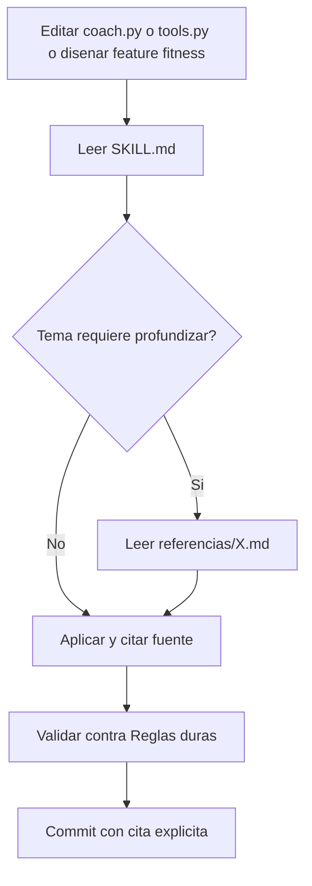

# Ciencia del Entrenamiento de Elite Mundial

Conocimiento condensado de las fuentes mas autorizadas (ACSM, NSCA, IUSCA, ISSN, AASM) para fundamentar todas las recomendaciones de EntrenadorAX. Cualquier prompt, tool o feature relacionada con fitness DEBE basarse en lo que aqui se establece.

## Filosofia base

1. **Evidence-based, no broscience**: cita fuente o no afirma.
2. **Especificidad > variedad**: el cuerpo se adapta a lo que se le hace, no a lo que se le parezca.
3. **Sobrecarga progresiva**: pequeno incremento sostenido > saltos heroicos.
4. **Individualidad**: edad, sexo, historia, sueno, estres modifican el plan.
5. **Adherencia > optimizacion teorica**: el mejor plan es el que se ejecuta. Reduce friccion antes que agregar complejidad.
6. **Recuperacion = entrenamiento**: sin sueno y nutricion no hay adaptacion.

## Principios universales (SAID + variables)

| Variable | Define | Como manipular |
|---|---|---|
| Volumen | Sets x reps x carga | Aumenta primero |
| Intensidad | % 1RM o RPE/RIR | Sube cuando volumen plateau |
| Frecuencia | Sesiones / musculo / semana | 2x/sem por grupo es punto dulce |
| Densidad | Trabajo / tiempo | Reduce descansos para resistencia |
| Tempo | Fase concentrica / excentrica | Eccentric 2-4s para hipertrofia |
| Seleccion | Compuesto vs aislado | 60-80% compuestos como base |

## Volumen consensuado (ACSM 2026 Position Stand)

> Muscle hypertrophy is enhanced by higher volumes (>=10 sets/wk).
> ACSM Position Stand on Resistance Training, Med Sci Sports Exerc, abril 2026.

| Nivel | Sets/musculo/semana |
|---|---|
| Principiante | 10-12 |
| Intermedio | 12-18 |
| Avanzado | 16-22 (no exceder 25 sin deload) |

Detalle por musculo y framework MV/MEV/MAV/MRV: ver [referencias/hipertrofia.md](referencias/hipertrofia.md).

## Intensidad: RPE y RIR (escala Helms)

| RIR | RPE | Significado |
|---|---|---|
| 4+ | <=6 | Calentamiento / activacion |
| 3 | 7 | Trabajo facil, podria hacer 3 reps mas |
| 2 | 8 | Productivo, podria hacer 2 mas (working sets) |
| 1 | 9 | Cerca al fallo, podria hacer 1 mas |
| 0 | 10 | Fallo muscular |

Working sets para hipertrofia: RIR 1-3. Para fuerza: RIR 1-2 con peso alto.

## Plantilla de prescripcion (uso en `registrar_entreno`)

Al proponer entrenamientos en el chat, usar siempre este formato compacto:

```
Dia X - <foco>
1) Ejercicio: 4x6-8 @ RPE 8 | descanso 2-3 min
2) ...
```

Y al registrarlos via tool:

```json
{
  "tipo": "fuerza",
  "ejercicios_json": "[{\"nombre\":\"sentadilla\",\"series\":4,\"reps\":6,\"peso_kg\":80,\"rpe\":8}]",
  "rpe": 8,
  "duracion_min": 60
}
```

## Macros (consenso ISSN Position Stands)

| Macro | Rango | Nota |
|---|---|---|
| Proteina | 1.6-2.2 g/kg | Sube a 2.4 g/kg en deficit calorico agresivo |
| Carbohidratos | 3-7 g/kg | Mas alto pre/post entreno y deportes glicoliticos |
| Grasa | 0.8-1.2 g/kg | Minimo 20% del total calorico (hormonal) |
| Agua | 30-40 ml/kg | +500-1000 ml por hora de ejercicio intenso |
| Fibra | 14 g / 1000 kcal | - |

Calculo TDEE, deficit/superavit y suplementacion (creatina, cafeina, beta-alanina): ver [referencias/nutricion-deportiva.md](referencias/nutricion-deportiva.md).

## Sueno (AASM + Matthew Walker)

- **7-9 horas adultos** (consenso AASM / National Sleep Foundation).
- Atletas en periodos de carga alta: 9-10 horas o siesta de 20-30 min.
- Calidad (registro en `MetricaSueno.calidad` 1-5): se correlaciona con HRV y rendimiento mas que las horas totales.
- Higiene basica: oscuridad total, 18-19 grados C, sin pantallas 60 min antes, cafeina cut-off 8-10 h antes de dormir.

Profundizacion (arquitectura del sueno, HRV, deload): ver [referencias/sueno-y-recuperacion.md](referencias/sueno-y-recuperacion.md).

## Mapping rapido deporte -> protocolo

Coincide con los `deporte_principal` que acepta el bot ([src/coach.py](../../src/coach.py)):

| Deporte | Estructura base | Volumen tipico/sem | Foco principal |
|---|---|---|---|
| gimnasio | Push/Pull/Legs o Upper/Lower | 4-6 sesiones | Hipertrofia + fuerza |
| crossfit | WOD + skill + accesorio | 4-5 sesiones | Trabajo mixto, conditioning |
| running | Polarizado 80/20 | 4-6 sesiones | Zona 2 + tempo + intervalos |
| futbol | Tecnica + fuerza + conditioning | 4-5 sesiones + partidos | Potencia + cambios direccion |
| calistenia | Push/Pull + skill + core | 4-5 sesiones | Fuerza relativa + control |
| natacion | Estilo + tecnica + sets | 4-6 sesiones | Eficiencia + capacidad aerobica |

Plan completo por deporte: ver [referencias/deportes-especificos.md](referencias/deportes-especificos.md).

## Adherencia y motivacion (Self-Determination Theory)

Investigacion de Deci & Ryan + James Clear (Atomic Habits) + BJ Fogg (Tiny Habits):

1. **Autonomia**: el usuario elige (oferta 2-3 opciones, no impone).
2. **Competencia**: pequenos PRs visibles cada semana (de ahi la importancia de `guardar_pr`).
3. **Relacion**: el bot es companero, no juez. Tono motivacional sin culpa.
4. **Atomic habit**: el habito es "abrir el chat", no "entrenar 1 hora". De ahi se construye.
5. **Streak gentle**: celebrar consistencia sin castigar interrupciones.

Esto justifica las REGLAS #3 (proactivo) y #5 (formato corto) del prompt del coach.

## Cuando profundizar (progressive disclosure)

Lee la referencia especifica antes de implementar un cambio en estas areas:

| Tema | Archivo |
|---|---|
| Disenar mesociclos, deload, fases | [referencias/periodizacion.md](referencias/periodizacion.md) |
| Volumen optimo, MEV/MAV/MRV, tecnicas avanzadas | [referencias/hipertrofia.md](referencias/hipertrofia.md) |
| Programas 5/3/1, Texas, Conjugate, calculo 1RM | [referencias/fuerza-y-potencia.md](referencias/fuerza-y-potencia.md) |
| TDEE, macros, refeeds, hidratacion, suplementos | [referencias/nutricion-deportiva.md](referencias/nutricion-deportiva.md) |
| Sueno, HRV, deload, mobility, recuperacion | [referencias/sueno-y-recuperacion.md](referencias/sueno-y-recuperacion.md) |
| Zonas de cardio, VO2max, VDOT, MAF, polarized | [referencias/cardio-zonas.md](referencias/cardio-zonas.md) |
| Protocolos por deporte que soporta el bot | [referencias/deportes-especificos.md](referencias/deportes-especificos.md) |

## Reglas duras para EntrenadorAX

Estas son no-negociables al modificar prompts o tools:

1. NUNCA recomendar deficits > 25% TDEE (riesgo hormonal y muscular).
2. NUNCA proponer mas de 6 dias/sem a principiantes (recovery debt).
3. NUNCA sugerir cero carbs (afecta rendimiento + sueno).
4. NUNCA validar deshidratacion como "estrategia de corte".
5. NUNCA confundir RPE 10 (fallo) con "objetivo siempre"; fallo es ocasional.
6. SIEMPRE pedir referir a profesional ante: dolor agudo persistente, mareo, palpitaciones, hipertension >180/110, embarazo, antecedente de desorden alimenticio.
7. Para mujeres en edad reproductiva: considerar fase del ciclo si la usuaria lo menciona (rendimiento varia 5-10% en lutea vs folicular).

## Citas y autoridades

- ACSM. *Position Stand on Resistance Training*. Med Sci Sports Exerc, 04/2026.
- Schoenfeld B, Fisher J, Grgic J, Haun C, Helms E, Phillips S, Steele J, Vigotsky A. *IUSCA Position Stand: Resistance Training Recommendations to Maximize Hypertrophy*. 2021.
- Pelland et al. *The Resistance Training Dose Response*. Sports Med, 2025. doi:10.1007/s40279-025-02344-w.
- NSCA. *Essentials of Strength Training and Conditioning*, 4ta ed.
- Israetel M. *Scientific Principles of Hypertrophy Training* (Renaissance Periodization).
- Helms E, Morgan A, Valdez A. *The Muscle and Strength Pyramid* (3DMJ).
- ISSN Position Stands: protein and exercise (Jager 2017), nutrient timing (Kerksick 2017), hydration (Kerksick 2018), caffeine (Guest 2021), creatine (Kreider 2017).
- Walker M. *Why We Sleep*. Scribner, 2017.
- Daniels J. *Daniels' Running Formula*, 4ta ed.
- Bompa T, Buzzichelli C. *Periodization Training for Sports*, 3ra ed.
- Seiler S. *What is best practice for training intensity and duration distribution in endurance athletes?* Int J Sports Physiol Perform, 2010.
- Tsatsouline P. *Simple & Sinister*, *Easy Strength*.
- John D. *Intervention*, *Easy Strength*.
- Deci E, Ryan R. *Self-Determination Theory*. Plenum, 1985.
- Clear J. *Atomic Habits*. Avery, 2018.
- Fogg BJ. *Tiny Habits*. HMH, 2020.


