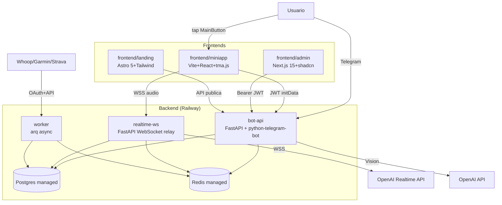
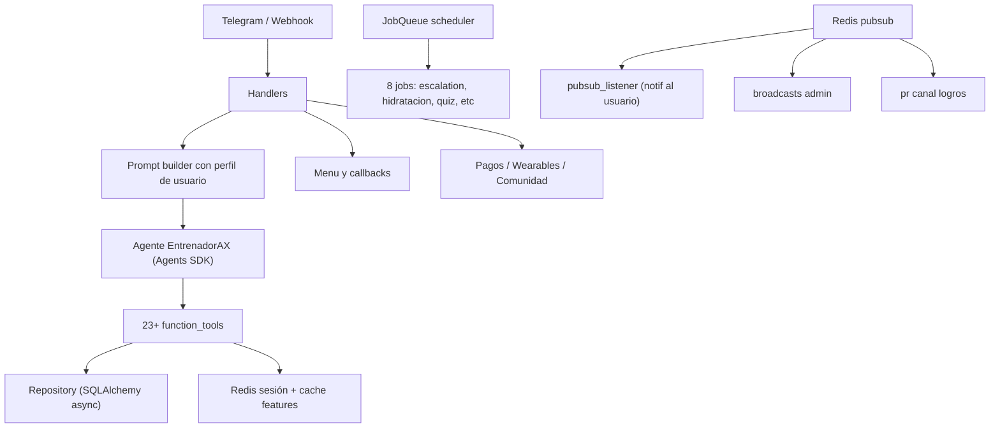

# Documentación Interna de EntrenadorAX V2

Plataforma multi-servicio: bot Telegram + Mini App + Admin web + WebSocket
Realtime + Worker + Landing. Deployada en Railway + Cloudflare Pages.

## Arquitectura V2

## Diagrama de arquitectura interna del bot

## Capas

| Capa | Modulos | Responsabilidad |
|---|---|---|
| API HTTP | `src/main.py`, `src/api/*` | FastAPI + webhook + REST + admin |
| Realtime WS | `src/realtime/server.py`, `src/realtime/*` | Relay WebSocket OpenAI |
| Worker | `src/worker/main.py`, `src/worker/jobs_*` | Sync wearables, rankings, procesado |
| Bot | `src/telegram/handlers.py`, `src/telegram/*` | Handlers, escalation, scheduler |
| Coach | `src/coach.py`, `src/tools.py` | Agente IA + tools |
| Services | `src/services/*` | TTS, Vision, Crisis, Pricing, etc |
| Persistence | `src/db/repository.py`, `src/db/models.py` | ORM + queries |
| Config | `src/config.py`, `src/cache.py` | Settings + Redis singleton |
| i18n | `src/i18n/{es,en,pt}.json` | Traducciones |

## 1. Cómo usa el agente el perfil y las herramientas

### 1.1. `src/coach.py`

Este archivo define al agente `EntrenadorAX` mediante la clase `Agent` de OpenAI Agents.

- `coach = Agent(...)` crea el agente con un nombre y un conjunto de instrucciones (`instructions`).
- Las instrucciones contienen reglas detalladas sobre:
  - onboarding conversacional.
  - cuándo y cómo usar cada herramienta.
  - el tono del bot: corto, directo, motivacional, no cursi.
  - su comportamiento proactivo: preguntar por entreno, comida y sueño.
  - cómo manejar errores y no mostrar fallos técnicos.

El agente no realiza lógica booleanas ni manipula la base de datos directamente. Su inteligencia se basa en generar una respuesta guiada por estas reglas y, cuando necesita actuar, llamar a las herramientas definidas en `src/tools.py`.

### 1.2. `src/tools.py`

Este archivo expone las herramientas que el agente puede usar. Cada función está decorada con `@function_tool` para que el agente las invoque como APIs de herramienta.

Las herramientas disponibles son:

- `obtener_perfil(telegram_id)`
  - Recupera el perfil completo del usuario.
  - Devuelve JSON con nombre, edad, peso, altura, objetivo, nivel, días de entrenamiento, deporte principal y estado de onboarding.

- `guardar_perfil(...)`
  - Actualiza el perfil del usuario en la base de datos.
  - Se usa durante el onboarding o cuando el agente recibe datos nuevos de perfil.
  - Solo envía los campos que contienen valores válidos.

- `registrar_entreno(...)`
  - Registra una sesión de entrenamiento.
  - Valida `tipo` frente a `fuerza`, `cardio`, `movilidad` y `deporte`.
  - Acepta lista JSON de ejercicios con `nombre`, `series`, `reps`, `peso_kg` y `rpe`.

- `obtener_pr(telegram_id, ejercicio)`
  - Consulta el mejor personal record de un ejercicio.

- `guardar_pr(...)`
  - Crea un nuevo PR para un ejercicio dado.

- `listar_todos_prs(telegram_id)`
  - Lista todos los PRs del usuario.

- `registrar_comida(...)`
  - Guarda una comida para el día.
  - Valida el `tipo` contra `desayuno`, `almuerzo`, `cena`, `snack`, `post_entreno`.

- `resumen_nutricional(telegram_id, fecha)`
  - Devuelve totales de calorías, proteínas, carbohidratos y grasas para un día.

- `registrar_sueno(...)`
  - Guarda horas, calidad (1-5) y notas de sueño.

- `reporte_progreso(telegram_id)`
  - Genera un reporte semanal completo.

- `registrar_peso(...)`
  - Registra el peso corporal actual y opcionalmente grasa y cintura.

- `consultar_historial_peso(telegram_id, limit)`
  - Devuelve los últimos registros de peso para ver tendencias.

### 1.3. Relación entre el agente y las herramientas

- El agente construye su respuesta con las instrucciones de `coach`.
- Cuando necesita leer o escribir datos, usa `tools.py` como funciones externas.
- Esto mantiene la lógica de conversación separada de la lógica de persistencia.
- Ejemplo: en onboarding, el agente pregunta datos y luego llama a `guardar_perfil`.

## 2. Cómo se transforma cada mensaje de Telegram en una pregunta para el agente

### 2.1. `src/telegram/handlers.py`

Este archivo es el puente entre Telegram y el agente.

#### Funciones principales:

- `start(update, ctx)`
  - Se ejecuta en `/start`.
  - Crea o actualiza el usuario con `obtener_o_crear_usuario(uid, nombre)`.
  - Envía el primer prompt: `Hola, quiero empezar!`.

- `mensaje(update, ctx)`
  - Se ejecuta para cualquier texto que no sea comando.
  - Controla rate limit con `check_rate_limit(uid)`.
  - Envía el texto del usuario al agente.

- `menu(update, ctx)`
  - Muestra un teclado inline con opciones rápidas.

- `reset(update, ctx)`
  - Elimina la sesión de Redis del usuario.

- `borrar_datos(update, ctx)` y `boton(update, ctx)`
  - Muestra botones de confirmación para borrar datos.
  - Procesa las acciones de los botones.

#### Flujo de mensaje a agente

1. Se recibe el mensaje de Telegram.
2. `mensaje()` llama a `_procesar(message, update.message.text, uid)`.
3. `_procesar()` construye el prompt con `_build_prompt(texto, uid)`.
4. `_build_prompt()` inyecta el perfil del usuario en el prompt:
   - `uid`, fecha actual, nombre, peso, altura, edad, objetivo, nivel, días de entrenamiento, deporte principal y onboarding.
5. Crea una sesión de Redis con `RedisSession.from_url(str(uid), url=settings.redis_url)`.
6. Ejecuta `Runner.run(coach, prompt, session=session, run_config=RUN_CONFIG)`.
7. Envía la salida del agente de vuelta al chat en trozos de 4000 caracteres.

Este diseño permite que el agente use el contexto de usuario en cada prompt y mantenga memoria de la conversación en Redis.

### 2.2. Mensajes del menú y botones

- Las acciones del menú se traducen a textos predefinidos.
- Ejemplo: el botón `entreno` envía `Quiero registrar mi entrenamiento de hoy`.
- Esto permite al agente recibir siempre una entrada natural, aunque provenga de un botón.

### 2.3. Manejo de errores de Telegram

- Si el agente lanza excepción, el bot responde con un mensaje genérico.
- Si se excede el rate limit, avisa al usuario que espere.

## 3. Recordatorios y programaciones

### 3.1. `src/telegram/scheduler.py`

Este archivo configura jobs recurrentes usando el `JobQueue` de `python-telegram-bot`.

#### Recordatorios disponibles:

- `recordatorio_entreno` (8:00)
  - Aviso si un usuario con onboarding completo no entrena en 2+ días.
  - Mensaje: recuerda registrar entreno o descansar bien.

- `recordatorio_sueno` (9:00)
  - Pregunta cómo durmió si el usuario no registró sueño hoy.

- `recordatorio_comida` (14:00)
  - Pregunta qué almorzó si no registró comida hoy.

- `checkin_nocturno` (21:00)
  - Revisa si el usuario no registró entreno o comida hoy.
  - Envía mensaje de cierre de día.

- `recordatorio_peso` (lunes 8:00)
  - Pregunta si hace más de 7 días que no registra peso.

- `resumen_semanal` (domingo 20:00)
  - Envía resumen semanal con días entrenados, volumen y nuevos PRs.

### 3.2. Condiciones para enviar recordatorios

- Solo se consideran usuarios con `onboarding_completo == True`.
- El sistema consulta si hay registros de entrenamiento, comida, sueno o peso según el día.
- Si faltan datos, envía un mensaje proactivo.

### 3.3. Registro de jobs

- `registrar_jobs(app)` añade los jobs al `JobQueue`.
- Este método se llama desde `run_bot.py` cuando arranca el bot.

## 4. Modelo de datos y persistencia

### 4.1. `src/db/models.py`

Define el esquema de base de datos con SQLAlchemy.

#### Tablas principales:

- `Usuario`
  - `telegram_id`: identificador único del usuario.
  - `nombre`, `edad`, `peso_kg`, `altura_cm`, `objetivo`, `nivel`, `dias_entreno`, `deporte_principal`.
  - `onboarding_completo`: marca si el perfil está completo.

- `SesionEntrenamiento`
  - Fecha, tipo (`TipoEjercicio`), duración, RPE y notas.
  - Relación con `EjercicioRealizado`.

- `EjercicioRealizado`
  - Ejercicio dentro de una sesión: nombre, series, reps, peso y rpe.

- `Comida`
  - Tipo de comida (`TipoComida`), lista de alimentos, calorías y macros.

- `PersonalRecord`
  - PR por ejercicio con peso, reps y fecha.

- `MetricaSueno`
  - Horas, calidad y notas de sueño.

- `MetricaCorporal`
  - Peso, grasa y cintura por fecha.

#### Enums de datos válidos:

- `TipoEjercicio`: `fuerza`, `cardio`, `movilidad`, `deporte`.
- `TipoComida`: `desayuno`, `almuerzo`, `cena`, `snack`, `post_entreno`.

### 4.2. `src/db/connection.py`

- Crea un engine asíncrono con `create_async_engine(settings.database_url)`.
- `init_db()` aplica `Base.metadata.create_all()` para crear tablas.
- `close_db()` cierra el engine.

### 4.3. `src/db/repository.py`

Contiene funciones que interactúan con la base de datos.

#### Usuario

- `obtener_o_crear_usuario(telegram_id, nombre="")`
  - Crea al usuario si no existe.
  - Actualiza el nombre si no estaba establecido.

- `actualizar_usuario(telegram_id, **kwargs)`
  - Actualiza solo los campos válidos.

- `eliminar_usuario(telegram_id)`
  - Borra el usuario y todos sus datos en cascada.

#### Sesiones de entrenamiento

- `guardar_sesion(...)`
  - Inserta una sesión y sus ejercicios.
  - Crea el usuario si no existía.

- `obtener_ultimas_sesiones(...)`
  - Recupera las últimas sesiones con ejercicios.

#### Personal Records

- `obtener_pr_ejercicio(telegram_id, ejercicio)`
  - Devuelve el mejor PR para un ejercicio.

- `guardar_pr(...)`
  - Inserta un nuevo PR.

- `listar_prs(telegram_id)`
  - Lista todos los PRs ordenados.

#### Métricas corporales

- `guardar_metrica_corporal(...)`
  - Inserta peso y medidas corporales.

- `historial_peso(telegram_id, limit)`
  - Devuelve los registros históricos de peso.

#### Comidas

- `guardar_comida(...)`
  - Inserta un registro de comida con alimentos serializados.

- `resumen_nutricional_dia(...)`
  - Suma calorías y macros por fecha.

#### Sueño

- `guardar_sueno(...)`
  - Inserta datos de sueño.

- `resumen_sueno_semanal(...)`
  - Calcula promedio de horas y calidad en 7 días.

#### Reportes

- `reporte_semanal(telegram_id)`
  - Calcula métricas de la última semana:
    - días entrenados
    - volumen total (peso x series x reps)
    - total de ejercicios
    - PRs nuevos
    - resumen de sueño

### 4.4. Relación entre herramientas y repositorio

- `src/tools.py` llama a las funciones de `src/db/repository.py`.
- Esto asegura que las reglas de negocios del agente están separadas de la persistencia.
- La capa `tools` valida entradas y prepara JSON, mientras que `repository` ejecuta SQLAlchemy.

## 5. Flujo completo de una interacción

1. El usuario envía un mensaje en Telegram.
2. `src/telegram/handlers.py` recibe el mensaje.
3. El handler construye un prompt con el perfil actual del usuario.
4. El prompt se ejecuta en el agente `EntrenadorAX`.
5. El agente decide si necesita llamar una herramienta.
6. Si usa una herramienta, `agents` invoca la función de `src/tools.py`.
7. `src/tools.py` consulta o actualiza la base de datos a través de `src/db/repository.py`.
8. La respuesta del agente se envía al usuario.

## 6. Aspectos importantes del diseño

### 6.1. Separación de responsabilidades

- `src/coach.py` define comportamiento conversacional.
- `src/tools.py` define acciones estructuradas.
- `src/db/repository.py` maneja datos.
- `src/telegram/handlers.py` maneja la interfaz Telegram.
- `src/telegram/scheduler.py` maneja recordatorios programados.

### 6.2. Uso de Redis

- Redis almacena la sesión conversacional y la memoria del agente.
- También se usa para limitar la tasa de mensajes por usuario.
- Si Redis no está disponible, el bot aún responde, pero la memoria de conversación y limitación pueden verse afectadas.

### 6.3. Validación de datos

- `tools.py` normaliza fechas con `_validar_fecha()`.
- Valida tipos de entrenamiento y comida.
- Evita guardar datos si el argumento no es válido.

### 6.4. Onboarding y datos completos

- El onboarding se considera completo cuando el usuario tiene:
  - peso
  - altura
  - objetivo
  - nivel
  - días de entrenamiento
  - deporte principal
- Hasta entonces, el agente debe hacer preguntas para completar el perfil.

## 7. Recomendaciones para extender o modificar

- Para agregar un nuevo tipo de herramienta, crea la función en `src/tools.py` y añádela a `ALL_TOOLS` en `src/coach.py`.
- Para cambiar la personalidad del bot, modifica el texto de `instructions` en `src/coach.py`.
- Para ajustar recordatorios, modifica los horarios y la lógica en `src/telegram/scheduler.py`.
- Para extender el modelo de datos, agrega nuevas columnas y tablas en `src/db/models.py` y actualiza `repository.py`.

## 8. Archivo generado

- `INTERNAL_ARCHITECTURE.md` contiene esta documentación profunda del proyecto.
