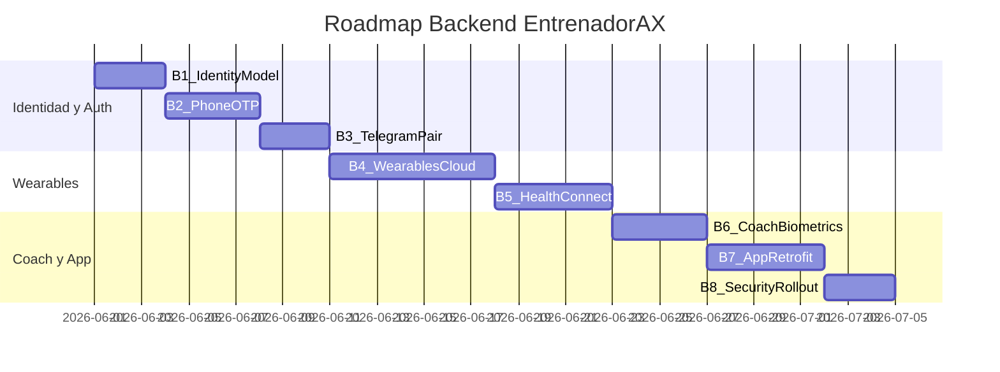

# Backend Integrations Roadmap (Fase B)

Plan de implementación backend en **EntrenadorPersonal** para reemplazar los mocks de EntrenadorAX Android.  
**No ejecutar hasta validar UX mock** (Fase A completada).

Referencia UX mock: `EntrenadorAXFrontend/docs/MOCK_INTEGRATIONS.md`

---

## Epic B1: Modelo de identidad unificado (teléfono + email + Telegram)

### B1.1 Migración DB

- Añadir `telefono VARCHAR(20) UNIQUE NULL` + índice en `usuarios`.
- Hacer `telegram_id` **nullable** (breaking: migración con backfill usuarios existentes).
- Añadir `phone_verified_at`; ampliar `auth_method`: `telegram`, `phone_email`, `mixed`.

### B1.2 Reglas de identidad

- Usuario puede existir: solo Telegram (legacy), solo phone+email (app nativa), o ambos (ideal).
- Email único global; teléfono único global.
- Vincular Telegram a cuenta phone-first: merge por email o link explícito.

### B1.3 Servicio `src/services/identity.py`

- `resolve_user_by_phone()`, `resolve_user_by_telegram()`, `link_telegram_to_user()`.

**Depende de:** validación UX auth mock (A2).

---

## Epic B2: Auth teléfono + OTP por email

### B2.1 OTP engine (Redis)

- `src/services/otp.py`: 6 dígitos, TTL 300s, rate limit 3/h por teléfono.
- Keys: `otp:phone:{e164}`, `otp:attempts:{e164}`.

### B2.2 Email OTP (Resend)

- Plantilla HTML OTP (reutilizar infra Resend de magic-link en `src/api/auth.py`).
- Config: `resend_api_key` existente.

### B2.3 Endpoints

- `POST /api/auth/phone/request-otp` — `{telefono, email?}`; teléfono nuevo exige email.
- `POST /api/auth/phone/verify-otp` — `{telefono, codigo}` → JWT largo (7–30 días).

### B2.4 JWT app nativa

- `JWT_APP_TTL_SECONDS = 2592000` (30 días).
- `get_uid_from_token` sin cambios (Bearer).

### B2.5 Tests

- `tests/test_auth_phone_otp.py`: happy path, OTP expirado, rate limit, registro vs login.

**Mock equivalente:** `MockAuthRepository`, OTP demo `123456`.

---

## Epic B3: Vinculación Telegram automatizada

### B3.1 Pair token (Redis)

- `POST /api/me/telegram/pair-token` (JWT) → `{token, url, expires_in}`.
- Key: `pair:{token}` → `user_id`, TTL 600s.

### B3.2 Handler bot

- Modificar `start()` en `src/telegram/handlers.py`: args `pair_<token>` → vincular `telegram_id`, confirmación + botón `entrenadorax://app/pair?status=success`.

### B3.3 Casos edge

- Token expirado, `telegram_id` ya usado, re-pair con confirmación.

### B3.4 Tests

- `tests/test_telegram_pair.py`: mock Redis + handler.

**Mock equivalente:** `TelegramPairScreen`, deep link `entrenadorax://app/pair?status=success`.

---

## Epic B4: Wearables — ampliar proveedores cloud

### B4.1 Oura API v2

- Añadir `oura` a proveedores; OAuth scopes sleep, daily_readiness, daily_activity.
- Sync: HRV, readiness, sueño.

### B4.2 Strava webhooks

- `POST /api/integraciones/strava/webhook` — verify + event create.
- Worker: activity → `datos_wearables_raw` → coach queue.

### B4.3 Fitbit Web API

- OAuth + sync sleep/steps/HR.

### B4.4 Garmin

- Mantener OAuth; documentar puente Strava para MVP.

### B4.5 Normalización

- `src/services/wearables_normalizer.py` → schema unificado:
  - `daily_steps`, `sleep_hours`, `hrv_ms`, `resting_hr`, `active_calories`, `last_workout_summary`.

**Reutiliza:** `src/services/wearables.py`, `src/api/integraciones.py`, `src/api/me.py`.

---

## Epic B5: Health Connect ingest (desde app Android)

### B5.1 Endpoint

- `POST /api/me/wearables/health-connect/sync` — JWT, JSON batches (steps, sleep, HR).

### B5.2 App Android real (post-mock)

- WorkManager cada 4h + sync manual desde IntegrationsHub.
- Permisos Health Connect SDK.

### B5.3 Almacenamiento

- Insertar en `datos_wearables_raw` con `proveedor=health_connect`.

---

## Epic B6: Coach IA consume biométricos

### B6.1 Vista consolidada

- `src/services/biometric_context.py` — resumen 24h/7d por usuario.

### B6.2 Prompt injection

- Bloque en `src/coach.py` system prompt:

  ```
  [BIOMETRICOS HOY]
  pasos, sueño, hrv, ultimo_entreno, estado_recuperacion
  ```

### B6.3 Proactive scheduler

- Job 19:00: usuarios bajo 40% meta pasos → mensaje Telegram (`src/telegram/scheduler.py`).

### B6.4 Tool opcional

- `@function_tool obtener_estado_biometrico(telegram_id)`.

**Mock equivalente:** `AxCoachInsightCard`, `MockCoachInsights` (5 escenarios).

---

## Epic B7: API móvil unificada + app Retrofit

### B7.1 Contratos OpenAPI

- Documentar en `docs/ENDPOINTS.md` todos los endpoints nuevos.

### B7.2 Android: reemplazar mocks

- Retrofit + OkHttp interceptor JWT.
- `EncryptedSharedPreferences` para token.
- Swap: `MockAuthRepository` → `ApiAuthRepository`, `MockIntegrationRepository` → `ApiIntegrationRepository`.

---

## Epic B8: Seguridad, observabilidad, rollout

- Rate limits auth (patrón `src/telegram/middlewares.py`).
- Audit log: `pair_telegram`, `connect_wearable`, `otp_sent`.
- Feature flags: `PHONE_AUTH_ENABLED`, `HEALTH_CONNECT_ENABLED`.
- Rollout: internal → beta Telegram → Play Store.

---

## Orden de ejecución recomendado



## Riesgos y mitigaciones

| Riesgo | Mitigación |
|--------|------------|
| `telegram_id NOT NULL` bloquea registro phone-first | B1: nullable + backfill |
| Garmin API costosa | Puente Strava; mock muestra badge "vía Strava" |
| Health Connect permisos Android 14+ | UX consent en app; mock explica permisos |
| OTP spam | Rate limit Redis (patrón auth.py existente) |
| Confusión mock vs prod | Banner dev + docs MOCK_INTEGRATIONS.md |

## Checklist Fase B (futuro)

- [ ] Migración identidad + phone OTP + JWT app
- [ ] Telegram pair token end-to-end
- [ ] Strava webhooks + Oura/Fitbit sync
- [ ] Health Connect ingest
- [ ] Coach biométrico + scheduler proactivo
- [ ] Retrofit en Android reemplazando mocks
