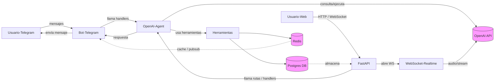

# Diagrama de flujo - EntrenadorAX

A continuación hay un diagrama de flujo en Mermaid que describe el flujo principal del sistema.

Leyenda:
- `Usuario (Telegram)` y `Usuario (Web)` muestran los puntos de entrada.
- `Bot Telegram` maneja el polling/webhook y enruta a los handlers.
- `OpenAI Agent` es el agente de coaching que decide acciones y llama a `src/tools.py`.
- `Herramientas` leen/escriben en `Postgres` y `Redis`.
- `WebSocket Realtime` se usa para llamadas de voz que pueden pasar audio a OpenAI Realtime.

Si quieres, puedo:
- renderizarlo y exportarlo a PNG/SVG;
- insertar el diagrama en `README.md`;
- ajustar el diagrama con más detalle (secuencias internas, scheduler, jobs, etc.).
